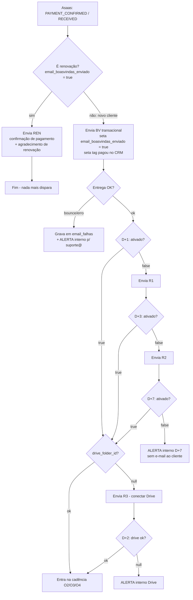

# Onboarding pós-pagamento — Fluxo de estados e anti-loop

## Campos de estado (Supabase, tabela de clientes)
| Campo | Tipo | Setado por |
|---|---|---|
| `pagamento_status` | ativo/cortesia/inativo | webhook Asaas |
| `email_boasvindas_enviado` | boolean | função de disparo do BV |
| `senha_criada` | boolean | fluxo "Primeiro acesso" em /conta |
| `ativado` | boolean | worker, ao receber `ATIVAR {codigo}` válido |
| `drive_folder_id` | text/null | OAuth Google concluído |
| `ultimo_email_recuperacao` | timestamp | qualquer R1/R2/R3 |

## Fluxograma (estado → disparo)

## Regras de anti-loop (ordem de precedência)

1. **Primeira pergunta do webhook: é renovação?** `email_boasvindas_enviado = true` → é renovação → envia **REN** (confirmação de pagamento + agradecimento) e encerra; nenhuma sequência de onboarding roda. `false` → novo cliente → envia **BV** e seta a flag. BV dispara UMA vez na vida do cliente; REN dispara a cada ciclo pago.
2. **Pagou = fora do marketing.** No momento do BV, aplicar tag `pagou` no lead do CRM. Toda campanha de nutrição (N1–N6) e lançamento (L1–L3) exclui `pagou` na lista de envio. Sync CRM→Campaigns diária no mínimo.
3. **Transacional ≠ marketing.** BV/R1/R2/R3 saem por remetente transacional (`contato@` via SMTP Zoho, não Campaigns). Sem esse split, cai na aba Promoções e a ativação morre.
4. **Recuperação checa estado NA HORA do envio**, não no agendamento. Se `ativado = true` quando R1/R2 for rodar → cancela silenciosamente. Nunca agendar cego.
5. **Ativou no meio da sequência → corta a sequência.** `ativado = true` cancela R1/R2 pendentes e alerta D+7.
6. **R3 só depois de ativar.** Condição: `ativado = true` AND `drive_folder_id IS NULL`. Quem nunca ativou recebe R1/R2, nunca R3 (um problema por vez).
7. **Máximo 1 e-mail de recuperação por dia** por contato (`ultimo_email_recuperacao` >= 24h).
8. **O2–O4 só começam com `ativado = true` AND `drive_folder_id NOT NULL`.** Senão o cliente recebe "manda tua primeira nota" sem ter onde ela cair.
9. **D+7 nunca vira e-mail pro cliente.** Já recebeu 3. O quarto é humano, via WhatsApp — alerta interno somente.
10. **Falha de entrega do BV:** gravar em `email_falhas` no Supabase + alerta pra suporte@. **Recomendação: opção (a) Supabase** — o webhook Asaas já vive lá, é 1 INSERT + 1 e-mail; Case no Zoho adicionaria dependência externa num fluxo crítico. Se quiser espelhar no CRM depois, dá pra criar o Case via MCP a partir da tabela.

## Remetente (obrigatório)
Todo e-mail ao cliente sai com nome de exibição **Notinha**: `From: "Notinha" <contato@usenotinha.com.br>`. Nunca "contato"/"suporte" como nome. No Zoho Campaigns: configurar "Sender name" = Notinha em cada campanha. Alertas internos: `Notinha Alertas`.

## Quem dispara o quê (implementação)
| Disparo | Mecanismo |
|---|---|
| BV | Edge Function (webhook Asaas, novo cliente) → SMTP Zoho `contato@` |
| REN | Edge Function (webhook Asaas, renovação) → SMTP Zoho `contato@` |
| R1/R2/R3/alertas | `pg_cron` diário no Supabase → checa estados → SMTP |
| Tag `pagou` no CRM | mesma Edge Function do BV, via API Zoho (ou eu via MCP em lote) |
| O2–O4 | Campaigns automação, lista `pagou` + `ativado` |

## Pendências pra funcionar
- [ ] Número WhatsApp no link `wa.me/{numero_whatsapp}` (placeholder nos HTMLs)
- [ ] `{link_oauth_drive}` — URL real do fluxo OAuth
- [ ] Campos `email_boasvindas_enviado`, `senha_criada`, `ultimo_email_recuperacao` na tabela (migração)
- [ ] Tabela `email_falhas`
- [ ] pg_cron job diário
